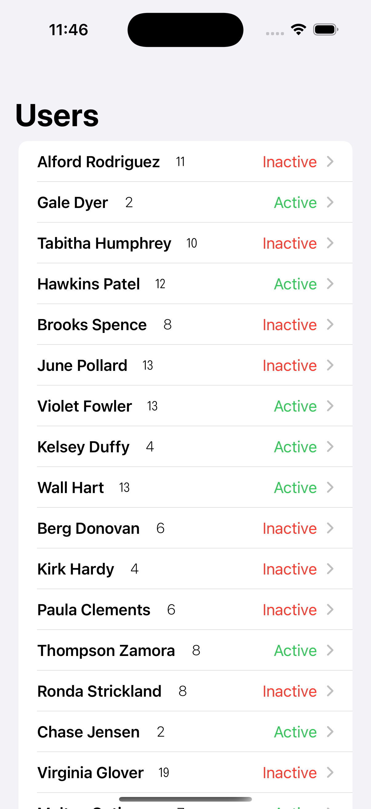

# Buddy Net Project

              

## Introduction

Buddy Net is an iOS application built using SwiftUI that fetches and displays user data from a JSON API. The app demonstrates the use of URLSession for network requests and Codable for parsing JSON data into Swift types. It also utilizes NavigationStack and List to present the information in a user-friendly format.

## Features

- **User Data Fetching:**
  - Downloads user data from a remote JSON source.
- **Data Modeling:** 
  - Implements User and Friend structs to represent user information and friendships.
- **List Display:**
  - Uses NavigationStack for seamless navigation between views.
- **Navigation:**
  - Presents user data in a structured list format.


## Installation

To get started with the Buddy Net project, follow these steps:

1. **Clone the repository:**
   ```bash
   git clone https://github.com/Serge-17/BuddyNet
